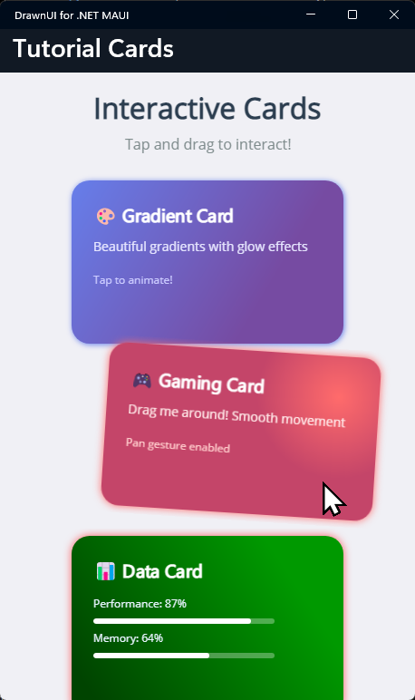

# Interactive Cards Tutorial: C# Fluent Syntax

Ready to build an animated, interactive card gallery using **pure C# with fluent syntax**? This tutorial shows you how to create the same beautiful cards from the [XAML version](interactive-cards.md) but using DrawnUI's powerful fluent API!

## 🚀 Live Demo in Tutorials Project

Want to see this in action first? Check out the [**DrawnUI Tutorials Project**](https://github.com/taublast/DrawnUi.Maui/tree/main/src/Maui/Samples/Tutorials) for:
- **Interactive Cards (Code)** - This tutorial in action
- **Interactive Cards (XAML)** - Same UI built with XAML  
- **Button Tutorial** - Game-style interactive buttons
- **News Feed Tutorial** - Advanced scrolling lists
- **First App** - Your first DrawnUI app

Clone the repo and run the Tutorials project to explore all examples!

## 🎯 What We'll Build

An interactive card gallery featuring:
- 🎨 **Beautiful gradient cards** with unicode text and controls
- ✨ **Smooth animations** (scale, rotation, color changing)
- 👆 **Gesture interactions** (tap, pan)
- 💫 **Visual effects** for shadows and glow  



## 🛠️ Step-by-Step Implementation

### 1. 📱 Setup Your MAUI Page

Create a basic MAUI page with DrawnUI Canvas:

```xml
<?xml version="1.0" encoding="utf-8" ?>
<ContentPage x:Class="CardsCodeDemo.MainPage"
             xmlns="http://schemas.microsoft.com/dotnet/2021/maui"
             xmlns:x="http://schemas.microsoft.com/winfx/2009/xaml"
             xmlns:draw="http://schemas.appomobi.com/drawnUi/2023/draw">

    <draw:Canvas x:Name="MainCanvas" 
                 BackgroundColor="DarkSlateBlue" />

</ContentPage>
```

### 2. 🏗️ Create Cards with Fluent C#

Now let's build the entire UI using fluent C# syntax in code-behind:

```csharp
using DrawnUi.Draw;

namespace CardsCodeDemo;

public partial class MainPage : ContentPage
{
    private SkiaLayout cardsContainer;
    private readonly List<SkiaShape> cards = new();

    public MainPage()
    {
        InitializeComponent();
        CreateCardsUI();
    }

    void CreateCardsUI()
    {
        // Create the main scroll container with cards
        var scrollContainer = new SkiaScroll()
        {
            Orientation = ScrollOrientation.Vertical,
            HorizontalOptions = LayoutOptions.Fill,
            VerticalOptions = LayoutOptions.Fill,
        }
        .WithChild(
            new SkiaLayout()
            {
                Type = LayoutType.Column,
                Spacing = 20,
                Margin = new Thickness(20),
                HorizontalOptions = LayoutOptions.Fill,
            }
            .Assign(out cardsContainer)
            .WithChildren(
                CreateHeaderSection(),
                CreateCard("🎮 Gaming", "Explore the latest games", Colors.Purple, Colors.DeepPink),
                CreateCard("🎵 Music", "Discover new sounds", Colors.Orange, Colors.Red),
                CreateCard("📚 Reading", "Dive into stories", Colors.Green, Colors.Teal),
                CreateCard("🎨 Art", "Create and inspire", Colors.Blue, Colors.Purple),
                CreateCard("🏃 Fitness", "Stay healthy", Colors.Red, Colors.Orange)
            )
        );

        MainCanvas.Children.Add(scrollContainer);
    }

    SkiaControl CreateHeaderSection()
    {
        return new SkiaLayout()
        {
            Type = LayoutType.Column,
            Spacing = 10,
            HorizontalOptions = LayoutOptions.Fill,
            Margin = new Thickness(0, 20, 0, 30),
        }
        .WithChildren(
            new SkiaLabel()
            {
                Text = "Interactive Cards",
                FontSize = 28,
                FontAttributes = FontAttributes.Bold,
                TextColor = Colors.White,
                HorizontalOptions = LayoutOptions.Center,
                UseCache = SkiaCacheType.Operations,
            },
            new SkiaLabel()
            {
                Text = "Built with C# Fluent Syntax",
                FontSize = 16,
                TextColor = Colors.LightGray,
                HorizontalOptions = LayoutOptions.Center,
                UseCache = SkiaCacheType.Operations,
            }
        );
    }

    SkiaShape CreateCard(string title, string subtitle, Color startColor, Color endColor)
    {
        SkiaShape cardShape = null;
        SkiaLabel titleLabel = null;
        SkiaLabel subtitleLabel = null;

        cardShape = new SkiaShape()
        {
            CornerRadius = 16,
            HeightRequest = 120,
            HorizontalOptions = LayoutOptions.Fill,
            UseCache = SkiaCacheType.Image,
            FillGradient = new SkiaGradient()
            {
                StartXRatio = 0,
                EndXRatio = 1,
                StartYRatio = 0,
                EndYRatio = 1,
                Colors = new[] { startColor, endColor }
            }
        }
        .WithVisualEffects(
            new DropShadowEffect()
            {
                Color = Colors.Black.WithAlpha(0.3f),
                Blur = 8,
                X = 0,
                Y = 4
            }
        )
        .WithChild(
            new SkiaLayout()
            {
                Type = LayoutType.Column,
                Spacing = 8,
                Margin = new Thickness(20),
                VerticalOptions = LayoutOptions.Center,
                HorizontalOptions = LayoutOptions.Start,
                UseCache = SkiaCacheType.Operations,
            }
            .WithChildren(
                new SkiaLabel()
                {
                    Text = title,
                    FontSize = 20,
                    FontAttributes = FontAttributes.Bold,
                    TextColor = Colors.White,
                    UseCache = SkiaCacheType.Operations,
                }
                .Assign(out titleLabel),
                new SkiaLabel()
                {
                    Text = subtitle,
                    FontSize = 14,
                    TextColor = Colors.White.WithAlpha(0.8f),
                    UseCache = SkiaCacheType.Operations,
                }
                .Assign(out subtitleLabel)
            )
        )
        .WithGestures((card, args, info) =>
        {
            switch (args.Type)
            {
                case TouchActionResult.Down:
                    AnimateCardPress(card, true);
                    break;
                case TouchActionResult.Up:
                case TouchActionResult.Cancelled:
                    AnimateCardPress(card, false);
                    break;
                case TouchActionResult.Tapped:
                    OnCardTapped(title);
                    break;
            }
            return card;
        });

        cards.Add(cardShape);
        return cardShape;
    }

    void AnimateCardPress(SkiaShape card, bool pressed)
    {
        var scale = pressed ? 0.95f : 1.0f;
        var opacity = pressed ? 0.8f : 1.0f;

        card.AnimateScaleTo(scale, 150, Easing.CubicOut);
        card.AnimateOpacityTo(opacity, 150, Easing.CubicOut);
    }

    async void OnCardTapped(string cardTitle)
    {
        await DisplayAlert("Card Tapped", $"You tapped: {cardTitle}", "OK");
    }
}
```

Now let's wrap it inside a Canvas to be used inside a usual MAUI app - that's all you need to integrate these beautiful cards into any existing MAUI project!

## 🎨 Understanding the Fluent Syntax

### Key Fluent Methods

**`.WithChild()` and `.WithChildren()`**
```csharp
layout.WithChild(new SkiaLabel { Text = "Single child" })
layout.WithChildren(child1, child2, child3)
```

**`.Assign(out variable)`**
```csharp
new SkiaLabel().Assign(out titleLabel)  // Assigns reference for later use
```

**`.WithGestures()`**
```csharp
card.WithGestures((control, args, info) => {
    // Handle gestures
    return control;
})
```

**`.WithVisualEffects()`**
```csharp
shape.WithVisualEffects(new DropShadowEffect { Blur = 8 })
```

### Animation Methods
```csharp
card.AnimateScaleTo(0.95f, 150, Easing.CubicOut);
card.AnimateOpacityTo(0.8f, 150, Easing.CubicOut);
```

## 🚀 Advanced Customization

### Custom Card Factory

```csharp
public static class CardFactory
{
    public static SkiaShape CreateGlowCard(string title, Color glowColor)
    {
        return new SkiaShape()
        {
            CornerRadius = 20,
            HeightRequest = 140,
            BackgroundColor = Colors.Black,
        }
        .WithVisualEffects(
            new DropShadowEffect()
            {
                Color = glowColor,
                Blur = 20,
                X = 0,
                Y = 0
            }
        )
        .WithChild(
            new SkiaLabel()
            {
                Text = title,
                TextColor = glowColor,
                FontSize = 18,
                FontAttributes = FontAttributes.Bold,
                HorizontalOptions = LayoutOptions.Center,
                VerticalOptions = LayoutOptions.Center,
            }
        );
    }
}
```

### Dynamic Card Creation

```csharp
void AddDynamicCard()
{
    var newCard = CreateCard("🆕 New", "Just added!", Colors.Cyan, Colors.Blue);
    
    cardsContainer.Children.Add(newCard);
    
    // Animate in
    newCard.Opacity = 0;
    newCard.Scale = 0.5f;
    newCard.AnimateOpacityTo(1, 300, Easing.BounceOut);
    newCard.AnimateScaleTo(1, 300, Easing.BounceOut);
}
```

## 💡 Performance Tips

1. **Use Caching**: `UseCache = SkiaCacheType.Image` for complex shapes
2. **Cache Text**: `UseCache = SkiaCacheType.Operations` for labels
3. **Assign References**: Use `.Assign(out variable)` for controls you'll modify
4. **Batch Animations**: Group multiple animations together

## 🎯 What You've Learned

- **Fluent C# Syntax**: Building UI with method chaining
- **Gesture Handling**: Interactive touch responses
- **Visual Effects**: Shadows, gradients, and animations
- **Performance**: Smart caching and optimization
- **Code Organization**: Clean, readable UI construction

## 🚀 Next Steps

Try experimenting with:
- **Custom animations** with different easing curves
- **Complex layouts** with nested fluent chains
- **Data binding** with ObservableCollections
- **Custom controls** using fluent patterns

The fluent syntax makes building complex UIs both powerful and enjoyable! 🎨
