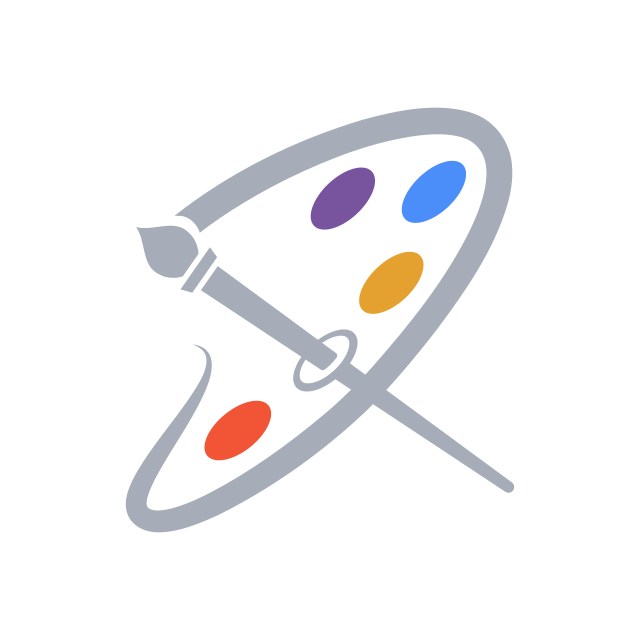

  <canvas id="heroCanvas" style="position:absolute; inset:0; width:100%; height:100%; display:block; border-radius: 12px;"></canvas>
  <!-- Fallback/augment radial glows in MAUI/Microsoft palette (blue/purple/teal) -->
  

  

    
    <h1 style="font-size: 3.5em; margin: 0; font-weight: 700; text-shadow: 0 2px 10px rgba(0,0,0,0.45);">
      DrawnUI for .NET
    </h1>
    

      Hardware-accelerated <strong>rendering engine</strong> for .NET, including MAUI, Blazor, and OpenTK, powered by SkiaSharp
    

    

      <a href="https://fiddle.drawnui.net" class="hero-btn hero-btn-primary" style="background: #2563eb; color: white; padding: 15px 30px; text-decoration: none; border-radius: 8px; font-weight: 600; box-shadow: 0 4px 15px rgba(37,99,235,0.35); transition: transform 0.2s ease, box-shadow 0.2s ease; display: inline-block; min-width: 160px; text-align: center;">
        🔨 Fiddle
      </a>
      <a href="https://github.com/DrawnUi/DrawnUi.Net" class="hero-btn hero-btn-secondary" style="background: rgba(255,255,255,0.12); color: white; padding: 15px 30px; text-decoration: none; border-radius: 8px; font-weight: 600; border: 2px solid rgba(255,255,255,0.22); backdrop-filter: blur(2px); display: inline-block; min-width: 160px; text-align: center;">
        ⭐ GitHub MIT
      </a>
    

  

  🤖 <strong style="color: white;">Teach your AI agent to use DrawnUI</strong> — see the <a href="articles/ai-skills.md" style="color: white; font-weight: 700; text-decoration: underline;">AI skills guide</a>.

## Choose Your Target

<!-- MAUI -->

  <h3 style="margin-top: 0; color: white;">MAUI</h3>
  
Use <strong>DrawnUi.Maui</strong> when you are building a native cross-platform app for iOS, Android, MacCatalyst, or Windows.

  
<strong>Install:</strong>

  <pre style="white-space: pre-wrap;"><code>dotnet add package DrawnUi.Maui</code></pre>
  
<a href="articles/maui/getting-started.md" style="color: #63b3ed; font-weight: 600; text-decoration: none;">MAUI setup guide →</a>

<!-- OPENTK -->

  <h3 style="margin-top: 0; color: white;">OpenTK</h3>
  
Use <strong>DrawnUi.OpenTk</strong> for native OpenGL desktop Window or Linux app, fully drawn or overlay for already existing projects.

  
<strong>Reference:</strong>

  <pre style="white-space: pre-wrap;"><code>dotnet add package DrawnUi.OpenTk</code></pre>
  
<a href="articles/opentk/index.md" style="color: #63b3ed; font-weight: 600; text-decoration: none;">OpenTK guide →</a>

<!-- BLAZOR -->

  <h3 style="margin-top: 0; color: white;">Blazor</h3>
  
Use <strong>DrawnUi.Blazor.Wasm</strong> for browser-local rendering, or <strong>DrawnUi.Blazor.Server</strong> for server-side rendering.

  
<strong>Install:</strong>

  <pre style="white-space: pre-wrap;"><code>dotnet add package DrawnUi.Blazor.Wasm
dotnet add package DrawnUi.Blazor.Server</code></pre>
  
<a href="articles/blazor/index.md" style="color: #63b3ed; font-weight: 600; text-decoration: none;">Blazor runtime guide →</a>

<!-- WASM -->

  <h3 style="margin-top: 0; color: white;">WebAssembly</h3>
  
Use <strong>DrawnUi.Wasm</strong> for a fully drawn web app — no Blazor, no Razor, just .NET WASM + SkiaSharp for WebAssembly.

  
<strong>Install:</strong>

  <pre style="white-space: pre-wrap;"><code>dotnet add package DrawnUi.Wasm</code></pre>
  
<a href="articles/web/index.md" style="color: #63b3ed; font-weight: 600; text-decoration: none;">DrawnUi.Wasm guide →</a>

<!-- NET -->

  <h3 style="margin-top: 0; color: white;">.NET</h3>
  
Use <strong>DrawnUi.Net</strong> when you need platform-agnostic rendering with SkiaSharp, server-side graphics, AI harness, tests and any other shared-logic development.

  
<strong>Install:</strong>

  <pre style="white-space: pre-wrap;"><code>dotnet add package DrawnUi.Net</code></pre>
  
<a href="articles/net/index.md" style="color: #63b3ed; font-weight: 600; text-decoration: none;">DrawnUi.Net guide →</a>

  <a href="articles/platforms.md" style="background: #4299e1; color: white; padding: 12px 25px; text-decoration: none; border-radius: 6px; font-weight: 600;">
    📖 Choose Your Package And Runtime
  </a>

---

## 🌟 What Is DrawnUI?

**DrawnUI** is a rendering engine for **.NET** built on top of **SkiaSharp** that brings together a complete layout system, gesture recognition, smooth animations, and custom-drawn controls across multiple hosts, including .NET MAUI, Blazor, and platform-agnostic .NET runtimes.

Unlike traditional UI stacks that rely only on native platform widgets, DrawnUI renders everything directly to SkiaSharp-powered surfaces. This approach gives you **pixel-perfect control** over your app's appearance while keeping a shared rendering model that can be hosted in native apps, browser runtimes, and headless .NET workflows.

**Key Architecture:**
- **SkiaSharp Foundation**: Leverages Google's Skia graphics engine for consistent, high-performance 2D rendering
- **Canvas-Based Layout**: Custom layout system that positions and sizes controls on hardware-accelerated surfaces
- **Gesture Engine**: Multi-touch gesture recognition system with support for complex interactions
- **Animation Pipeline**: Smooth, performant animations using GPU acceleration and intelligent caching
- **Virtual Controls**: Lightweight control system without native platform overhead

Perfect for apps requiring **custom UI designs**, **complex animations**, **game-like interfaces**, **headless rendering workflows**, or **pixel-perfect cross-platform consistency** that traditional controls alone can't achieve.

😯 <a href="https://drawnui.net/sandbox/" target="_blank" rel="noopener noreferrer">See Blazor WebAssembly sample</a>

### 🏃 **Master Performance**
- **Fast App Startup** for totally drawn apps
- **Caching system** for retained rendering
- **Hardware acceleration** on all platforms
- **Virtual controls** - no native overhead

### 🎨 **Unleash Creativity**
- **Pixel-perfect** cross-platform consistency
- **Gesture system** with multi-touch support
- **2D/3D transforms** and visual effects
- **Custom shaders** and filters

😃 <a href="https://fiddle.drawnui.net" target="_blank" rel="noopener noreferrer">Don't miss the Fiddle!</a>

### 👨‍💻 **Familiar Yet Powerful**
- **MAUI/WFP-like** properties for layout etc
- **Shell-like** navigation on canvas (MAUI only, others soon)
- **XAML + Hot Reload** support
- **Fluent C#** syntax for code-behind UI with bindings
- **Accessible** canvas (Blazor only, others soon)

---

## 📔 Learn More

  <h4 style="margin-bottom: 15px;">📖 Documentation</h4>
  
Complete guides and API reference

  <a href="articles/platforms.md" style="color: #4299e1; text-decoration: none; font-weight: 600;">Choose Your Target →</a> 
  <a href="articles/net/index.md" style="color: #4299e1; text-decoration: none; font-weight: 600;">DrawnUi.Net →</a> 
  <a href="articles/opentk/index.md" style="color: #4299e1; text-decoration: none; font-weight: 600;">OpenTK →</a> 
  <a href="articles/maui/getting-started.md" style="color: #4299e1; text-decoration: none; font-weight: 600;">Getting Started →</a> 
  <a href="articles/blazor/index.md" style="color: #4299e1; text-decoration: none; font-weight: 600;">Blazor →</a> 
  <a href="articles/web/index.md" style="color: #4299e1; text-decoration: none; font-weight: 600;">DrawnUi.Wasm →</a> 
  <a href="articles/controls/index.md" style="color: #4299e1; text-decoration: none; font-weight: 600;">Controls Reference →</a> 
  <a href="articles/advanced/index.md" style="color: #4299e1; text-decoration: none; font-weight: 600;">Advanced Topics →</a> 
  <a href="/api/" style="color: #4299e1; text-decoration: none; font-weight: 600;">API Reference →</a>

  <h4 style="margin-bottom: 15px;">🧙 Tutorials</h4>
  
Step-by-step practical examples

  <a href="articles/tutorials.md" style="color: #4299e1; text-decoration: none; font-weight: 600;">View Tutorials →</a> 
  <a href="articles/sample-apps.md" style="color: #4299e1; text-decoration: none; font-weight: 600;">Sample Apps →</a> 
  <a href="articles/fluent-extensions.md" style="color: #4299e1; text-decoration: none; font-weight: 600;">Fluent Syntax →</a>

  <h4 style="margin-bottom: 15px;">🤖 AI Agents</h4>
  
Teach your coding agent DrawnUI

  <a href="articles/ai-skills.md" style="color: #4299e1; text-decoration: none; font-weight: 600;">AI Skills →</a> 
  <a href="/llms.txt" style="color: #4299e1; text-decoration: none; font-weight: 600;">llms.txt →</a> 
  <a href="https://fiddle.drawnui.net" style="color: #4299e1; text-decoration: none; font-weight: 600;">Fiddle →</a>

  <h4 style="margin-bottom: 15px;">💬 Community</h4>
  
Get help and share your creations

  <a href="https://github.com/DrawnUi/DrawnUi.Net/discussions" style="color: #4299e1; text-decoration: none; font-weight: 600;">GitHub Discussions →</a> 
  <a href="https://github.com/DrawnUi/DrawnUi.Net/issues" style="color: #4299e1; text-decoration: none; font-weight: 600;">Report Issues →</a> 
  <a href="articles/faq.md" style="color: #4299e1; text-decoration: none; font-weight: 600;">FAQ →</a>

---

  

    
    
    
  

  

    By <a href="https://taublast.github.io" style="color: #4299e1; text-decoration: none;">Nick Kovalsky</a> (<a href="https://www.linkedin.com/in/nick-kovalsky-92a770174/">Available for commercial work</a>) and contributors
  

